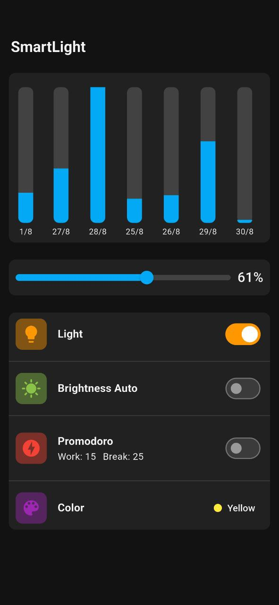

# 💡 Smart Light Controller

Ứng dụng điều khiển đèn thông minh được phát triển bằng Flutter, tích hợp Firebase Realtime Database để quản lý và giám sát hệ thống chiếu sáng từ xa.


## ✨ Tính năng chính

### 🔆 Điều khiển đèn
- **Bật/Tắt đèn**: Điều khiển nguồn đèn từ xa
- **Điều chỉnh độ sáng**: Slider tùy chỉnh độ sáng theo ý muốn
- **Chế độ tự động**: Tự động điều chỉnh độ sáng theo môi trường
- **Thay đổi màu sắc**: Chuyển đổi giữa ánh sáng vàng và trắng

### ⏰ Pomodoro Timer
- **Tích hợp timer Pomodoro**: Hỗ trợ phương pháp học tập/làm việc hiệu quả
- **Tùy chỉnh thời gian**: Cài đặt thời gian work và break
- **Tự động điều khiển đèn**: Đèn thay đổi theo chu kỳ Pomodoro

### 📊 Giám sát và Thống kê
- **Biểu đồ sử dụng**: Theo dõi mức độ sử dụng đèn theo thời gian
- **Lịch sử hoạt động**: Xem lại các thao tác đã thực hiện

### 🎨 Giao diện người dùng
- **Material Design 3**: Giao diện hiện đại, thân thiện
- **Dark/Light Theme**: Tự động thích ứng theo theme hệ thống

## 🛠️ Công nghệ sử dụng

### Frontend
- **Flutter 3.8+**: Framework phát triển ứng dụng đa nền tảng
- **Riverpod**: State management hiện đại và hiệu quả

### Backend & Services
- **Firebase Realtime Database**: Cơ sở dữ liệu thời gian thực
- **Firebase Messaging**: Dịch vụ push notification
- **Local Notifications**: Thông báo local cho Pomodoro

### UI/UX Libraries
- **Material Design 3**: Design system của Google
- **Number Picker**: Widget chọn số cho timer
- **Custom Widgets**: Slider, cards, và controls tùy chỉnh

## 📱 Screenshots




## 🚀 Bắt đầu

### Yêu cầu hệ thống
- Flutter SDK 3.8.1 hoặc cao hơn
- Dart SDK 3.0+
- Android Studio / VS Code
- Firebase account

### Cài đặt

1. **Clone repository**
```bash
git clone https://github.com/yourusername/flutter_smartlight.git
cd flutter_smartlight
```

2. **Cài đặt dependencies**
```bash
flutter pub get
```

3. **Cấu hình Firebase**
```bash
# Tạo project Firebase mới tại https://console.firebase.google.com
# Tải file google-services.json và đặt vào android/app/
# Tạo file lib/firebase_options.dart với cấu hình Firebase
```

4. **Chạy ứng dụng**
```bash
flutter run
```

### Cấu hình Firebase

1. **Tạo Firebase Project**
   - Truy cập [Firebase Console](https://console.firebase.google.com)
   - Tạo project mới
   - Kích hoạt Realtime Database và Firebase Messaging

2. **Cấu hình Android**
   ```bash
   # Thêm google-services.json vào android/app/
   # Cập nhật android/build.gradle và android/app/build.gradle
   ```

3. **Cấu hình iOS** (optional)
   ```bash
   # Thêm GoogleService-Info.plist vào ios/Runner/
   # Cập nhật ios/Runner/Info.plist
   ```

## 📂 Cấu trúc dự án

```
lib/
├── main.dart                          # Entry point
├── firebase_options.dart              # Firebase configuration
├── core/
│   └── service/
│       └── firebase_service.dart      # Firebase services
└── features/
    └── smart_light/
        ├── application/
        │   └── led_controller_provider.dart  # State management
        ├── domain/
        │   └── models/                # Data models
        └── presentation/
            ├── home_screen.dart       # Main screen
            └── widgets/
                ├── brightness_slider.dart
                ├── control_card.dart
                └── chart_card.dart
```

## 🔧 Cấu hình

### Environment Variables
Tạo file `.env` trong thư mục root:
```env
FIREBASE_API_KEY=your_api_key
FIREBASE_PROJECT_ID=your_project_id
FIREBASE_MESSAGING_SENDER_ID=your_sender_id
```

### Firebase Realtime Database Structure
```json
{
  "LED_CONTROL": {
    "control": {
      "nutNguon": "1",           // 0: OFF, 1: ON
      "nutDoiMau": "0",          // 0: White, 1: Yellow
      "nutTuDongSang": "0",      // 0: Manual, 1: Auto
      "doSangCuaDen": "50",            // 0-100
      "nutTuDongSang": "0"             // 0-1 
    },
    "promodoro": {
      "isNotifiOn": "0",         // 0: OFF, 1: ON
      "timeWork": "25",          // Work time in minutes
      "timeBreak": "5"           // Break time in minutes
    },
    "timeUse": {
      "2025-08-30": "45",       
      "2025-08-29": "25",       
    }
  }
}
```

## 🤝 Đóng góp
1. Fork project
2. Tạo feature branch (`git checkout -b feature/AmazingFeature`)
3. Commit changes (`git commit -m 'Add some AmazingFeature'`)
4. Push to branch (`git push origin feature/AmazingFeature`)
5. Tạo Pull Request


## 🐛 Báo lỗi
Nếu bạn gặp lỗi, vui lòng tạo [issue](https://github.com/yourusername/flutter_smartlight/issues) với:
- Mô tả chi tiết lỗi
- Steps để reproduce
- Screenshots (nếu có)
- Device/OS information


## 🙏 Acknowledgments
- [Flutter Team](https://flutter.dev) - Framework tuyệt vời
- [Firebase](https://firebase.google.com) - Backend as a Service
- [Material Design](https://material.io) - Design system
- [Riverpod](https://riverpod.dev) - State management solution

---

⭐ **Nếu project này hữu ích, hãy cho một star nhé!** ⭐
